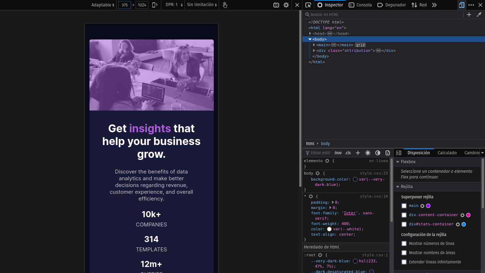
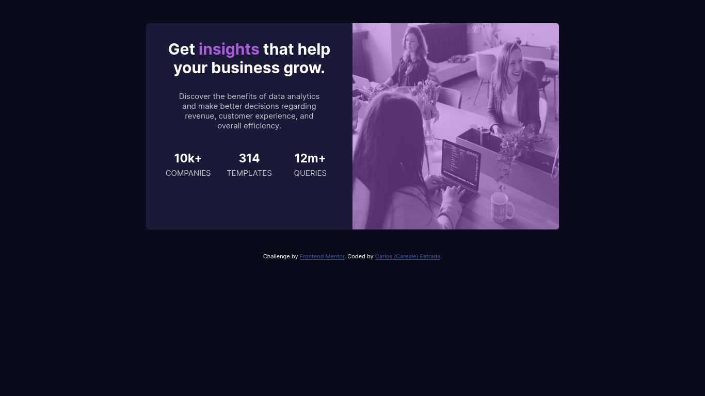
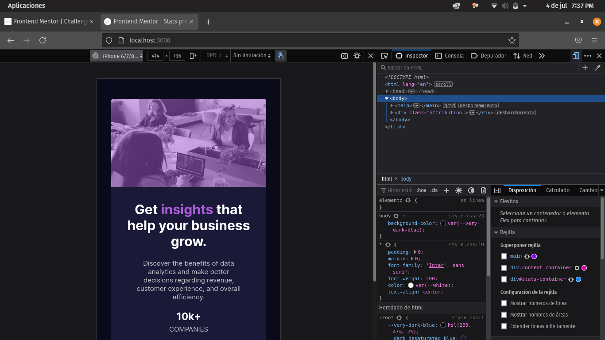
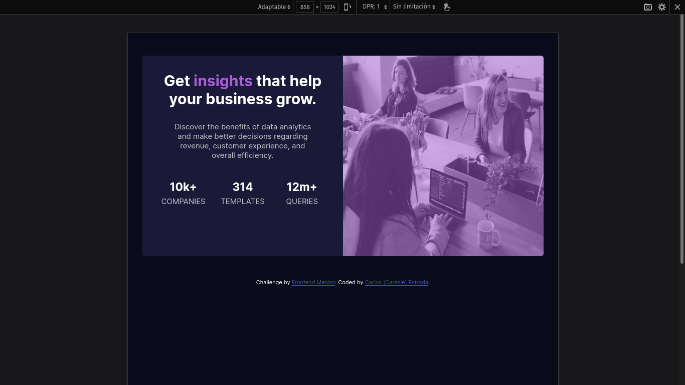

# Frontend Mentor - Stats preview card component solution Español

Esta es una solución para el [Stats preview card component challenge on Frontend Mentor](https://www.frontendmentor.io/challenges/stats-preview-card-component-8JqbgoU62). Los retos de Frontend Mentor pueden ayudarte a mejorar tus habilidades por medio de crear proyectos reales.

## Tabla de contenidos

- [Información general](#información-general)
  - [El reto](#el-reto)
  - [Screenshot](#screenshot)
  - [Links](#links)
- [Mi proceso](#mi-proceso)
  - [Herramientas utilizadas](#herramientas-utilizadas)
  - [Lo que aprendí](#lo-que-aprendí)
- [Autor](#autor)

## Información general

### El reto

Los usuarios deberán ser capaces de:

- Ver la disposición correcta dependiendo del tamaño de la pantalla de su dispositivo.

### Screenshot
### Versión de telefono final
  

### Versión de escritorio final
 

## Tamaño personalizado de la pantalla del telefono
  

### Tamaño personalizado de la pantalla de la computadora
  

### Links
- URL para la solución: [Solution page](https://www.frontendmentor.io/solutions/html-css-IXFNGfeD2)
- URL para probar el sitio: [Github pages](https://caresle.github.io/stats-preview-card-component/)

## Mi proceso

### Herramientas utilizadas

- HTML5
- CSS
- CSS Grid
- Mobile-first workflow

### Lo que aprendí

**Como añadir color a una imagen**  
En proyectos pasados nunca había agregado una imagen de fondo y luego color a esta.

Enseguida está el código que use para lograr esto:
```css
/* En mi caso background-element es #img-content */
background-element {
  background: linear-gradient(var(--soft-violet-alpha), var(--soft-violet-alpha)),
    url("images/image-header-desktop.jpg");
}
```

## Autor

- Frontend Mentor - [@Caresle](https://www.frontendmentor.io/profile/Caresle)
- Instagram - [@caresle1](https://instagram.com/caresle1)