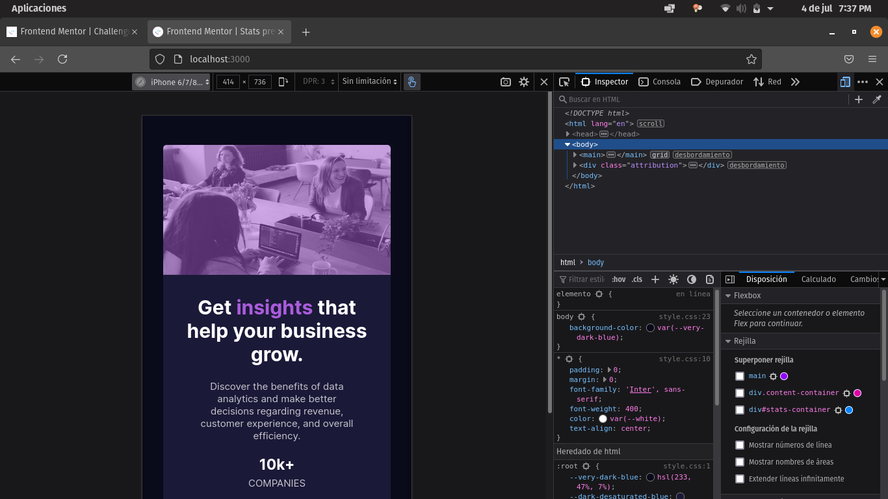
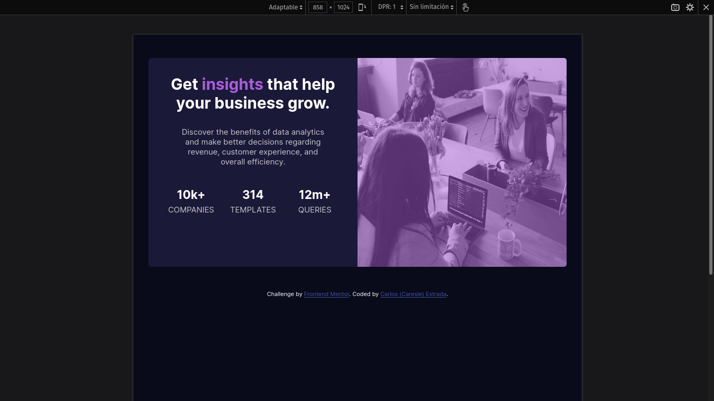

# Frontend Mentor - Stats preview card component solution

This is a solution to the [Stats preview card component challenge on Frontend Mentor](https://www.frontendmentor.io/challenges/stats-preview-card-component-8JqbgoU62). Frontend Mentor challenges help you improve your coding skills by building realistic projects. 

[README spanish version](./README-es.md)
## Table of contents

- [Overview](#overview)
  - [The challenge](#the-challenge)
  - [Screenshot](#screenshot)
  - [Links](#links)
- [My process](#my-process)
  - [Built with](#built-with)
  - [What I learned](#what-i-learned)
- [Author](#author)

## Overview

### The challenge

Users should be able to:

- View the optimal layout depending on their device's screen size

### Screenshot  
### Mobile final
  

### Desktop final
  

### Custom mobile resolution
  

### Custom desktop resolution
  

### Links
- Solution URL: [Solution page](https://www.frontendmentor.io/solutions/html-css-IXFNGfeD2)
- Live Site URL: [Github pages](https://caresle.github.io/stats-preview-card-component/)

## My process

### Built with

- HTML5
- CSS
- CSS Grid
- Mobile-first workflow

### What I learned

**How to add color to an image**

In the projects before this i never add a background image and then a color to this.

Next it's the code that i use for this:
```css
/* In my case background-element it's #img-content */
background-element {
  background: linear-gradient(var(--soft-violet-alpha), var(--soft-violet-alpha)),
    url("images/image-header-desktop.jpg");
}
```

## Author

- Frontend Mentor - [@Caresle](https://www.frontendmentor.io/profile/Caresle)
- Instagram - [@caresle1](https://instagram.com/caresle1)

